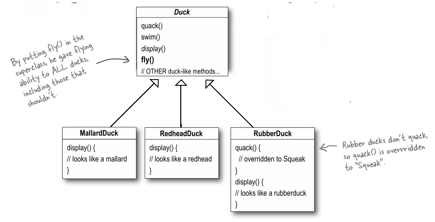
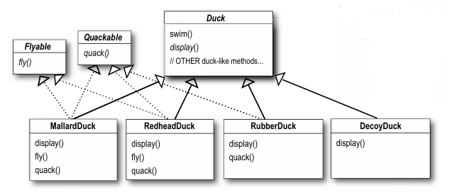
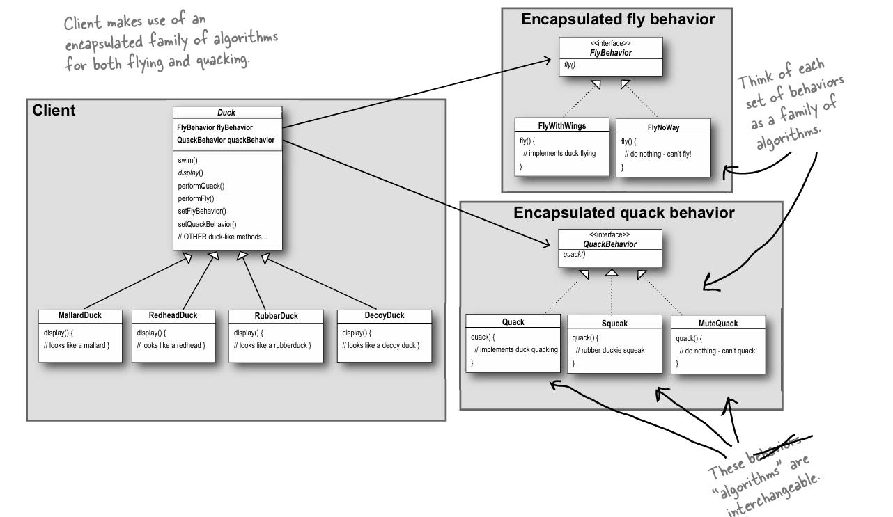

# First principle : Encapsulate What Varies

You add a small feature. Suddenly, you’re rewriting code in five different places?

You introduce a new class. Suddenly, all your other classes break?

You update one behavior... and find yourself copy-pasting the same logic to 12 subclasses?

If this sounds familiar, chances are you’ve built a system where changing things is painful.

Let’s walk through a real-world case and discover one of the most powerful principles in flexible design:

**Encapsulate What Varies — the first principle from Head First Design Patterns.**

## 🦆 The Problem: SimuDuck Gone Wild

You're building a duck simulator: SimuDuck.

Each duck should be able to:

Swim 

Quack 🦆

So you start simple with a Duck class:


```java
class Duck {
    public void quack() {
        System.out.println("Quack!");
    }

    public void swim() {
        System.out.println("Swimming...");
    }
}
```
 So far, so good.

## 🟨 Requirement 1: “Let the ducks fly!”

Management says: “Add flying ducks!”

You naively add fly() to the superclass:

```java
class Duck {
     public void quack() {
        System.out.println("Quack!");
    }

    public void swim() {
        System.out.println("Swimming...");
    }

    public void fly() {
        System.out.println("I’m flying!");
    }
}

```
But wait… 🤔 what about rubber ducks?

## 🟥 Requirement 2: Rubber Ducks

You add a subclass:

```java

class RubberDuck extends Duck {
    @Override
    public void quack() {
        // do nothing
    }

    @Override
    public void fly() {
        // do nothing
    }
}
```
And now… we’re overriding fly() and quack() with empty methods.

Something feels wrong.

- We’re violating the idea of inheritance

- Every subclass must override logic it didn’t want in the first place

- Code duplication everywhere

- Maintenance is a nightmare

**🔥 So What’s Wrong?**

You assumed inheritance = reuse

But you ended up inheriting inappropriate behavior

You had to rewrite the same methods over and over again

And when flying behavior changes?

You’ll need to update it in every duck subclass that flies.

It’s brittle. It’s messy. It’s wrong.

##  Solution 1: Inheritance

 - Every behavior is in the superclass

 - Can’t customize easily

 - Code reuse drops

 - Bugs increase with every new duck type

## Solution 2: Interfaces

You move behaviors to interfaces:

```java

interface Flyable {
    void fly();
}

class MallardDuck implements Flyable { ... }
class RubberDuck { ... } 
```

This solves some problems but introduces others:

- Now ducks only implement what they need

- But behaviors must be reimplemented in each class

- Still no shared reusable logic

- Still painful to update behaviors system-wide

## ✅ Solution 3: Encapsulate What Varies

Here’s the breakthrough:

> Take the parts that vary and encapsulate them in separate objects.
> 
> So you can change behavior without touching unrelated code.

**How?**

👉 Define behavior objects, and make your `Duck` class delegate to them.


**💡 Applying the Principle**

Step 1: Define Behavior Interfaces


Step 2: Create Behavior Implementations


Step 3: Refactor Duck Class


Step 4: Create Ducks with Custom Behaviors

```java 

class MallardDuck extends Duck {
    public MallardDuck() {
        flyBehavior = new FlyWithWings();
        quackBehavior = new QuackLoud();
    }
}

class RubberDuck extends Duck {
    public RubberDuck() {
        flyBehavior = new FlyNoWay();
        quackBehavior = new MuteQuack();
    }
}

```

**Change Behavior at Runtime!**

```java
Duck modelDuck = new MallardDuck();
modelDuck.performFly(); // Flying with wings!

modelDuck.setFlyBehavior(new FlyNoWay());
modelDuck.performFly(); // I can't fly
```
Dynamic behavior without changing the class.

Why Does This Principle Matter?

Because change is inevitable.
Features change. Clients change. Business logic changes.

Your code must embrace change, not fear it.

**Encapsulate What Varies allows your system to grow without collapsing under its own weight.**


**❓ Common Questions About "Encapsulate What Varies"**

1- 🧩 “Doesn’t this create too many classes?”

Yes — and that’s okay.

You’re trading one big rigid class for many small flexible ones.

Small classes are easier to test 

Easier to understand 

Easier to reuse 

And much easier to change 

Don’t fear more classes — fear entangled logic.

2-  “When should I encapsulate a behavior?”

When the answer to either is “yes”:

Is this behavior changing frequently?

Is this behavior used in multiple places?

Then encapsulate it.

3- “Can I mix inheritance and encapsulation?”

Yes! Strategy Pattern (which implements this principle) often uses:

Inheritance for shared data or structure

Composition (encapsulated behavior) for things that change

You don’t have to pick a side — use both wisely.


4- “Can I change behavior at runtime?”
Absolutely — that’s a major benefit.

With: 
```java
duck.setFlyBehavior(new FlyWithRocket());
```

You can make ducks dynamically adopt new behaviors.

5- “Isn’t this just the Strategy Pattern?”

Yes — in fact:

Encapsulate What Varies is the core idea behind the Strategy Pattern.

But it's also a mindset:
Whenever you see behavior that keeps changing, think:

“Should this live in a separate object?”

That’s encapsulation in action.

# Second principle : Program to an Interface, Not an Implementation

What Does It Really Mean?

Don’t hardcode behavior.
Rely on abstractions instead of details.

✅ Good:

```java
FlyBehavior fb = new FlyWithWings();
```

❌ Bad:

```java
FlyWithWings fb = new FlyWithWings();
```

## ❓ Common Questions

“Does this only apply to interfaces?”

No. It also applies to:

Abstract classes

Function signatures

Service contracts

Even APIs and modules

Wherever you're depending on something — depend on the what, not the how.

“How does this relate to Dependency Injection?”
Great question. They’re best friends.

Program to an interface tells you what to depend on.
Dependency injection tells you how to provide that dependency.

Together, they enable decoupled and pluggable architecture.

# Third and final principle from Head First Design Patterns:Favor Composition Over Inheritance


Instead of inheriting behavior, ducks now delegate it.


**❓ Common Questions**
“Is inheritance always bad?”
No. Inheritance is fine when:

You have true IS-A relationships

Behavior is stable, not changing

You’re not overriding half the superclass methods

If you're fighting the inheritance tree — it's a sign you need composition.

“Does composition mean more objects?”
Yes. But small, focused objects are easy to:

Test ✅

Reuse 🔁

Maintain 🔧

You’re trading complexity in logic for clarity in structure.

“Can I use both?”
Absolutely.

A Duck may inherit from an abstract Bird,
but compose its FlyBehavior and QuackBehavior.

That’s not just okay — that’s often ideal.


# 📁 Folder Structure

```bash
DesignPrinciples/
└── SimuDuck/
├── Duck.java
├── MallardDuck.java
├── RubberDuck.java
├── FlyBehavior.java
├── FlyWithWings.java
├── FlyNoWay.java
├── QuackBehavior.java
├── QuackLoud.java
├── MuteQuack.java
├── Test.java
```

All code available here → [GitHub Folder](/DesignPrinciples/SimuDuck/)